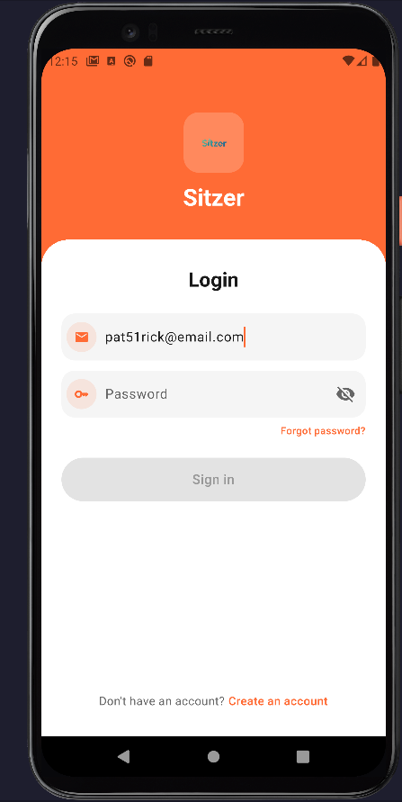
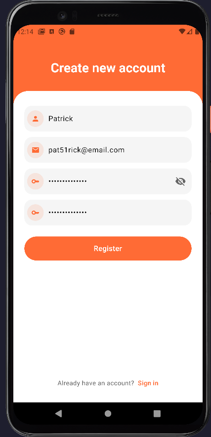
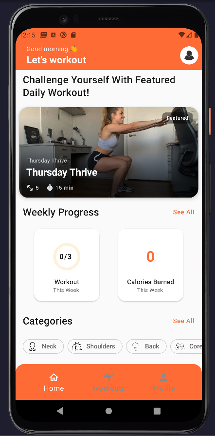
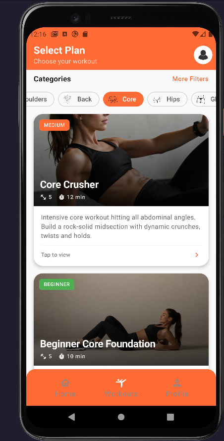
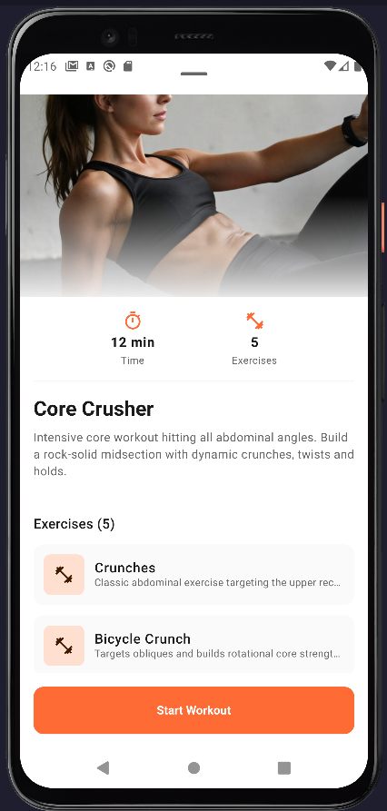
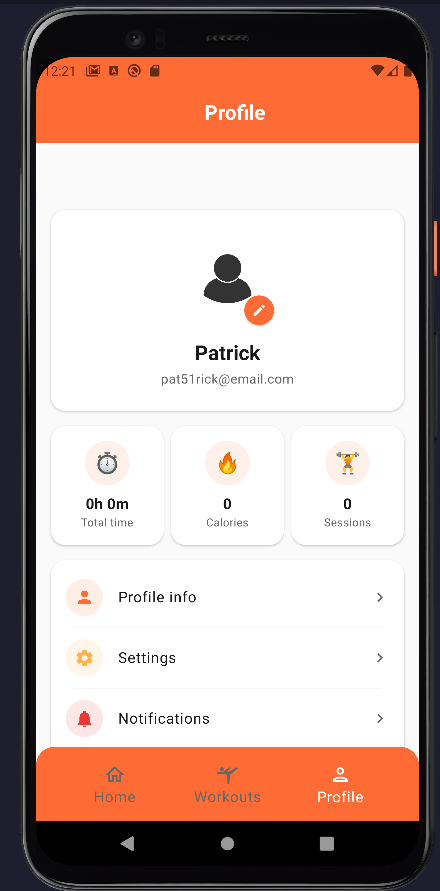
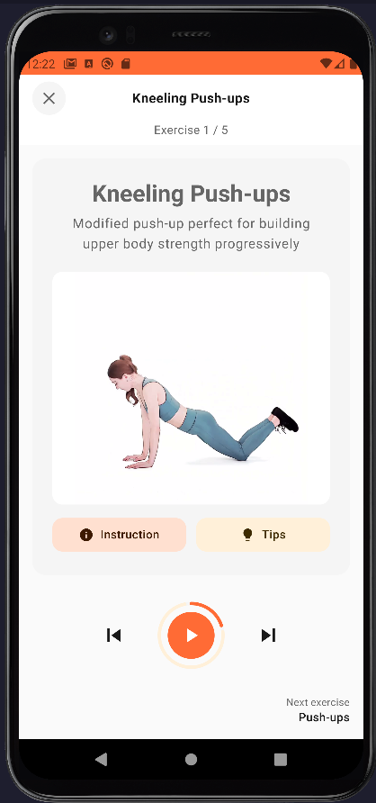
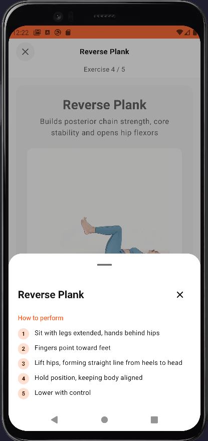

# 🪑 Sitzer - Sitting Posture Correction App

> **Health & Fitness mobile application designed to reduce negative effects of sedentary lifestyle through personalized exercises and posture correction.**

---

## 📱 Overview

Sitzer is a mobile health application that helps users combat the negative effects of prolonged sitting by:
- Providing personalized exercise plans targeting key muscle groups
- Tracking daily workout progress
- Sending reminders for movement breaks
- Offering detailed exercise instructions with video guidance

**Project Purpose:** Developed as a portfolio project to demonstrate full-stack Android development and comprehensive QA testing skills.

---

## ✨ Key Features

### 🏃 Workout Management
- **3 Workout Plans:** Beginner, Intermediate, Advanced
- **30+ Exercises** with detailed instructions and video demonstrations
- **Exercise Timer** with audio/visual cues
- **Progress Tracking** - daily completion statistics

### 👤 User Management
- Secure authentication (Login/Register)
- Profile customization (avatar, user data)
- Persistent user preferences (DataStore)

### 🎨 Customization
- **Dark/Light Theme** with system default option
- **Internationalization** (Polish/English)
- Theme and language persistence across sessions

### 🔔 Smart Notifications
- Daily workout reminders
- Customizable notification schedules
- WorkManager-based background tasks

---

## 🏗️ Architecture & Tech Stack

### Architecture Pattern
- **MVVM (Model-View-ViewModel)** for separation of concerns
- **Single Activity** with Jetpack Navigation
- **Unidirectional Data Flow** with StateFlow

### Core Technologies
- • Kotlin
- • UI: Jetpack Compose (declarative UI)
- • DI: Hilt (dependency injection)
- • Database: Room + SQLite (local persistence)
- • Preferences: DataStore (key-value storage)
- • Background: WorkManager (notifications scheduling)
- • Navigation: Jetpack Navigation Compose
- • State: StateFlow, LiveData
- • Coroutines: Async operations

## 📷 Screenshots

  
  
  
  

  
  
  
  

