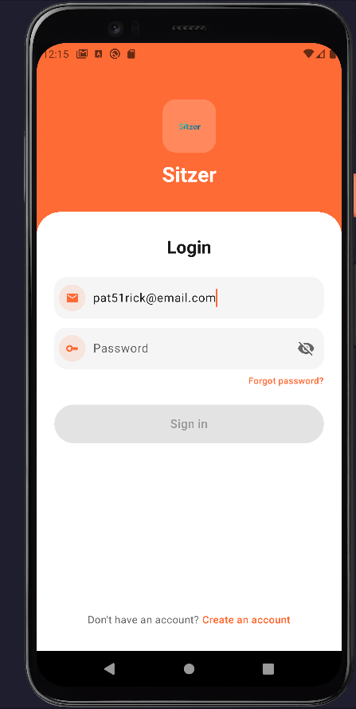
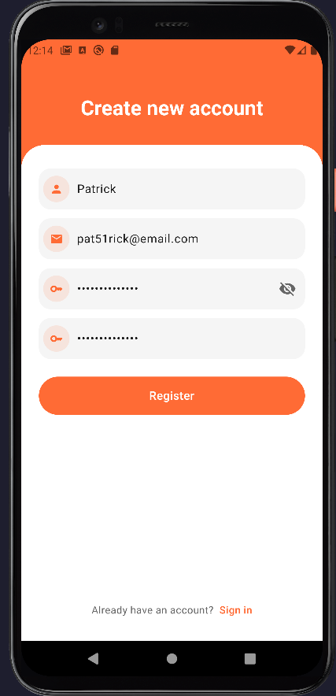
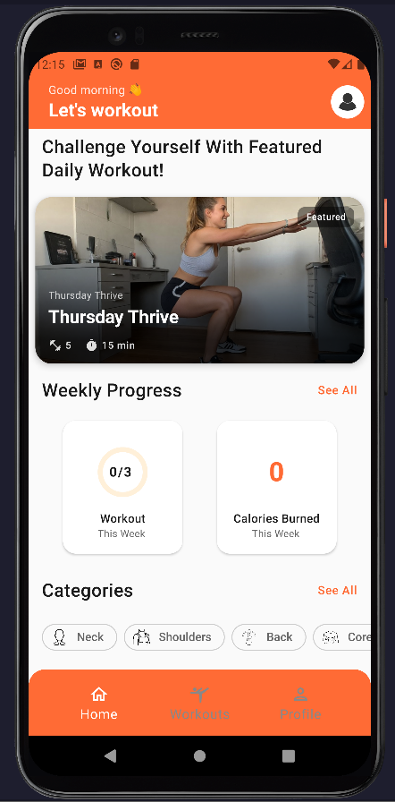
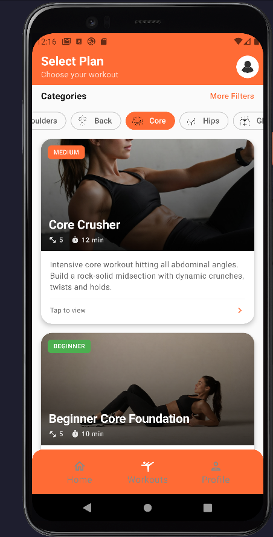
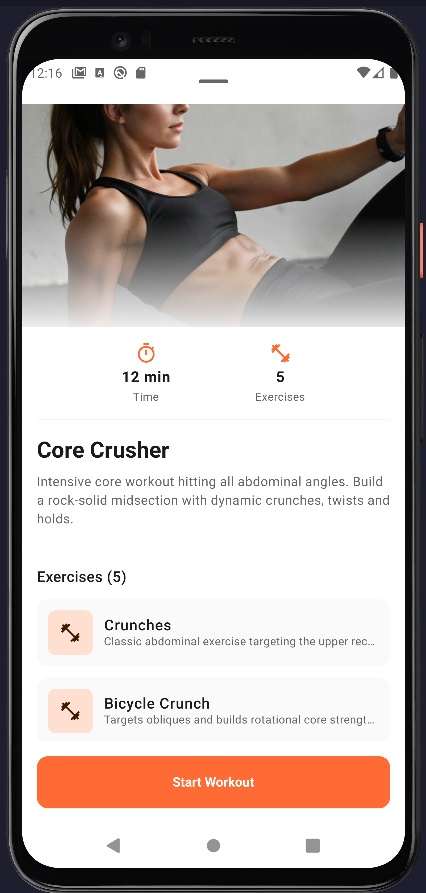
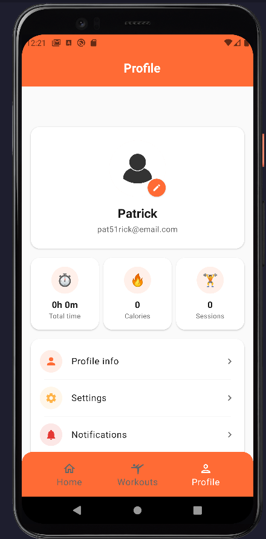
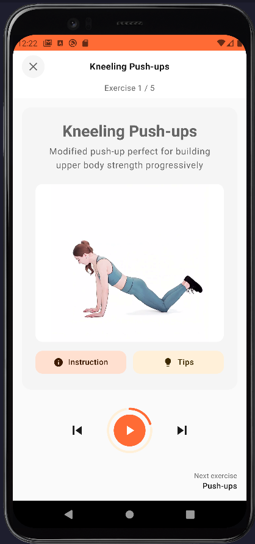
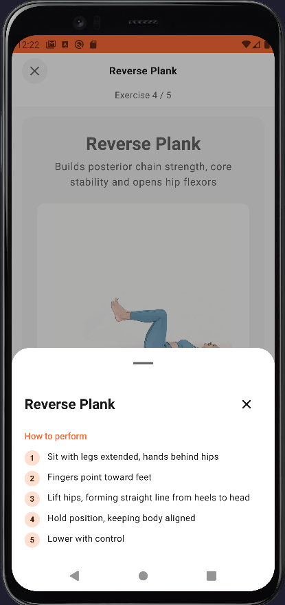

# 🪑 Sitzer - Sitting Posture Correction App

> **Health & Fitness mobile application designed to reduce negative effects of sedentary lifestyle
through personalized exercises and posture correction.**

---

## 📱 Overview

Sitzer is a mobile health application that helps users combat the negative effects of prolonged
sitting by:

- Providing personalized exercise plans targeting key muscle groups
- Tracking daily workout progress
- Sending reminders for movement breaks
- Offering detailed exercise instructions with video guidance

**Project Purpose:** Developed as a portfolio project to demonstrate full-stack Android development
and comprehensive QA testing skills.

---

## ✨ Key Features

### 🏃 Workout Management

- **3 Workout Plans:** Beginner, Intermediate, Advanced
- **30+ Exercises** with detailed instructions and video demonstrations
- **Exercise Timer** with audio/visual cues
- **Progress Tracking** — daily completion statistics

### 👤 User Management

- Secure authentication (Login/Register)
- Profile customization (avatar, user data)
- Persistent user preferences (DataStore)

### 🎨 Customization

- **Dark/Light Theme** with system default option
- **Internationalization** (Polish/English)
- Theme and language persistence across sessions

### 🔔 Smart Notifications

- Daily workout reminders
- Customizable notification schedules
- WorkManager-based background tasks

---

## 🏗️ Architecture & Tech Stack

### Architecture Pattern

- **MVVM (Model-View-ViewModel)** for separation of concerns
- **Single Activity** with Jetpack Navigation
- **Unidirectional Data Flow** with StateFlow
- **Repository Pattern** for data abstraction

### Core Technologies

| Layer       | Technology          |
|-------------|---------------------|
| Language    | Kotlin              |
| UI          | Jetpack Compose     |
| DI          | Hilt                |
| Database    | Room + SQLite       |
| Preferences | DataStore           |
| Background  | WorkManager         |
| Navigation  | Navigation Compose  |
| State       | StateFlow, LiveData |
| Async       | Coroutines          |
| Images      | Coil                |

---

## 🧪 QA & Testing

This project includes a **complete QA lifecycle** — from requirements analysis and test planning to
defect reporting, following **ISTQB best practices**.

### 📋 Test Planning & Management

- Planned the full testing process and **created a project backlog** in **Jira** including Epics,
  User Stories, Sprint Planning, and Testing Tasks
- Organized testing activities using an **Agile workflow**
- Prepared Software Requirements Specification, Test Plan, and Testing Strategy

### ✅ Test Coverage

- Designed and executed **100+ manual and automated test cases** across **5 application modules**:
    - Authentication
    - Home Screen
    - Workout Module
    - Profile Management
    - Settings & Notifications

### 🔍 Testing Types Applied

- Manual & Functional Testing
- Regression & Smoke Testing
- UI Testing (Espresso)
- Integration Testing
- Room Database Testing (JUnit + Mockito)
- SQL Injection Validation
- Localization Testing (PL/EN)
- State Restoration & Configuration Change Testing

### 🐞 Defect Management

- Identified and reported **21 software defects** with assigned **Priority** and **Severity** levels
- Documented reproduction steps, expected vs. actual results, and proposed fixes
- Followed **ISTQB defect reporting best practices**

**Examples of identified issues:**

- Authentication & input validation edge cases
- Email and password format validation failures
- Screen rotation state loss
- Localization (i18n) inconsistencies
- Avatar handling bugs
- Theme and language persistence issues
- UI recomposition problems

### 🛠️ Testing Environment

- Android Studio · Jira · Git & GitHub
- Android Emulator · Physical Android Devices · ADB

---

## 📷 Screenshots

  
  
  
  

  
  
  
  

